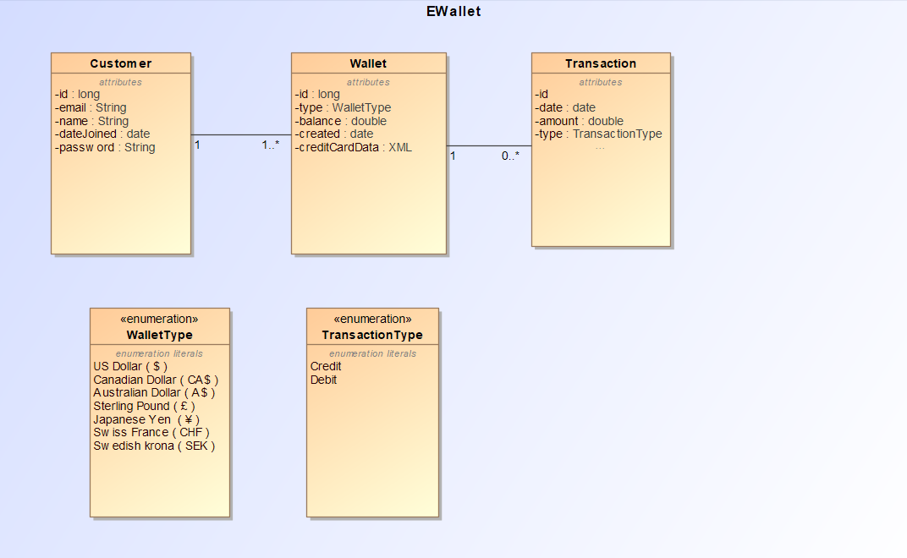
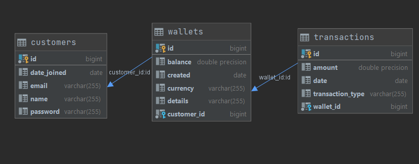

# EWallet-Api

## Description

Implement e-wallet with REST API to create it, top it up, check its balance and withdraw funds using Spring (preferably Spring Boot). Funds on any wallet should
not go below zero. The project should be built with Maven or Gradle

### Requirements:

- Docker-Compose 1.28
- Gradle 6.8
- Java 11

### Starting(Application has to be run with dev profile):

Step 1: run `docker-compose up` as a terminal command in the root of Project/repository

Step 2:

- run `gradle bootRun --args='--spring.profiles.active=dev' --stacktrace` in the root of repository        
  OR:
- Open in IntelliJ, add 'dev' to active profiles and run ApiApplication

### Swagger API Documentation

[http://localhost:8284/swagger-ui.html](http://localhost:8284/swagger-ui.html)

### Possible Next Steps/Things to improve:

- Write Test Routines for the Application
- Build, test and run with Docker
- Error Logging for Administrator, Simple Error Message for Consumer

### Notes:

- Backend has support for more features those currently implemented in the UI
- Most of the endpoints are in Wallet Rest
- Not All service methods have end-points(useful for future additions)
- Not All end-points are currently being used, some will be used in future
- Current Configuration only for development Environment.
- Sometimes there is failure by the application or IntelliJ to create the correct Implementaion for mapper interfaces leading to DTO containing all fields as
  null